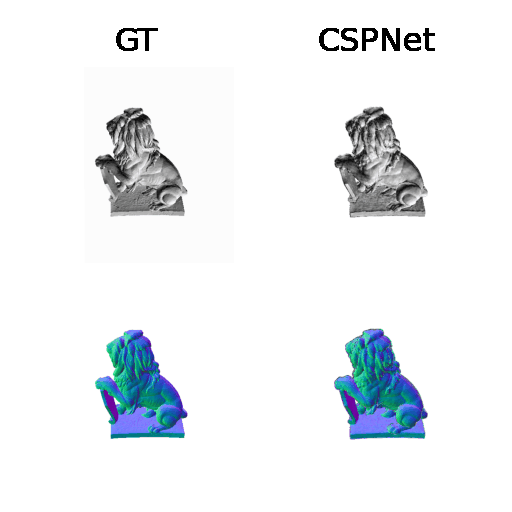
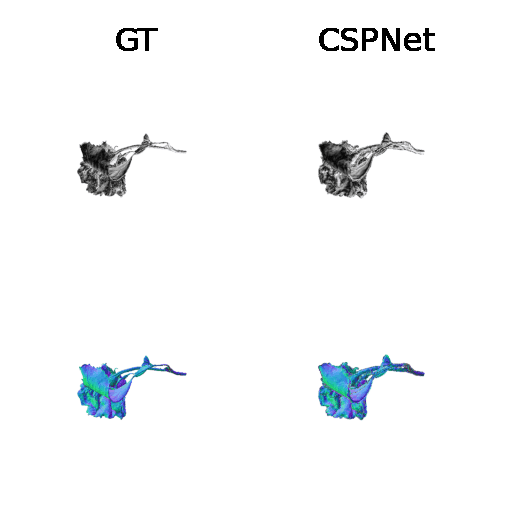

# Deep Implicit Surface Point Prediction Networks
## [Project Page](https://sites.google.com/view/cspnet) | [Paper](https://arxiv.org/abs/2106.05779)
    
<!--
-->

If you find our code or paper useful, please cite as

    @InProceedings{Venkatesh_2021_ICCV,
        author    = {Venkatesh, Rahul and Karmali, Tejan and Sharma, Sarthak and Ghosh, Aurobrata and Babu, R. Venkatesh and Jeni, Laszlo A. and Singh, Maneesh},
        title     = {Deep Implicit Surface Point Prediction Networks},
        booktitle = {Proceedings of the IEEE/CVF International Conference on Computer Vision (ICCV)},
        month     = {October},
        year      = {2021},
        pages     = {12653-12662}
    }


### Setting up environment

Create an anaconda environment called `mesh_funcspace` using
```
conda env create -f environment.yml
conda activate mesh_funcspace
```

## Single Shape CSP
### Training
To train a on a new 3D shape, run
```
python single_shape_csp/pt_pred/train.py -ename=EXP_NAME -infile=OFF_FILE_PATH
```
for eg.
```
python single_shape_csp/pt_pred/train.py -ename=lion -infile=./single_shape_csp/data/lion.off
```

### Evaluation
For evaluation of the models, run:
```
python single_shape_csp/pt_pred/test.py -ename=EXP_NAME -model_iter=MODEL_ITER -reverse -num_views=NUM_VIEWS
```
where `EXP_NAME` is the experiment name to pick the weights from, `MODEL_ITER` is the checkpoint in `EXP NAME` (which can can be found in `single_shape_csp/weights/EXP_NAME/MODEL_ITER.pt`), and `NUM_VIEWS` is number of azimuths to uniformly sample for multi-view rendering.

The generated files can be found at `single_shape_csp/videos/EXP_NAME`.

## Multi-shape CSP

Coming Soon!
